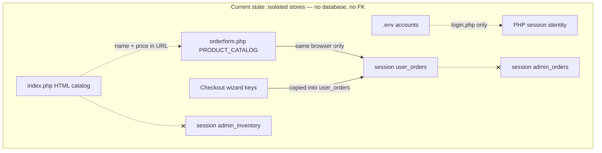
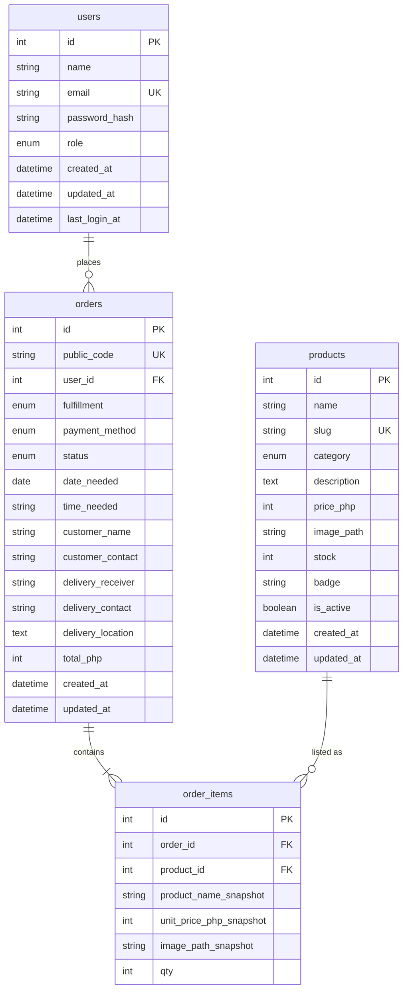

# Database design — KDesigns Blooms & Styles

**Important:** there is **no MariaDB schema in use today**. phpMyAdmin would be empty for this app. What exists now is PHP session arrays and hardcoded catalogs. The **target ERD** below is the design from the [strategic plan](../STRATEGIC-PLAN.md) (Phase 1).

Preview the diagrams:

- [`current-logical.mermaid`](current-logical.mermaid) — as-is (no foreign keys)
- [`target-erd.mermaid`](target-erd.mermaid) — planned tables and relationships

Open those files in Cursor/VS Code with a Mermaid preview, or paste into [mermaid.live](https://mermaid.live).

---

## 1. Current state (not a database)

Nothing is related by id. Closing the browser drops customer orders. Admin never sees checkout.

### 1.1 Identity

| Store | Fields | Connected to |
|---|---|---|
| `.env` | `ADMIN_EMAIL`, `ADMIN_NAME`, `ADMIN_HASH`, `CUSTOMER_EMAIL`, `CUSTOMER_NAME`, `CUSTOMER_HASH` | `login.php` only |
| Session (`login.php` / `signup.php`) | `user_email`, `user_name`, `user_role`, `last_activity` | Not used by `admin.php` |
| Session (`admin.php`) | `admin_logged_in` | Separate flag; **no FK to a user** |

Signup hashes a password and **does not save it** anywhere.

### 1.2 Three catalogs (same products, no shared key)

| Store | Identifying “key” | Attributes |
|---|---|---|
| `index.php` HTML | Product title in markup | category, description, price text, stock **text**, badge, image, order URL |
| `orderform.php` `PRODUCT_CATALOG` | Product **name** string | `price` (int), `img` |
| `$_SESSION['admin_inventory']` | Array index | `name`, `category`, `price` (display string), `stock` (int), `badge`, `img` |

Counts today: homepage **12** cards, checkout whitelist **11**, admin inventory **8**. Autumn Harvest Wreath is on the homepage only.

### 1.3 Two order lists (not joined)

**`$_SESSION['user_orders'][]`** (written by checkout):

| Attribute | Example |
|---|---|
| `id` | `KDB-248193` (random, not a table PK) |
| `product_name` | Crimson Romance Bouquet |
| `price` | `₱1,850` (formatted string) |
| `fulfillment` | Pickup / Delivery |
| `date_needed` | `2026-09-08` |
| `time_needed` | string |
| `image` | `images/IMG_8603.JPG` |
| `status` | `PENDING` |
| `placed_date` | `Sep 8, 2026` |

No `user_id`. No line items. Qty is always implied 1. Delivery fields stay in **other** session keys (`delivery_receiver`, `delivery_contact`, `delivery_location`) and are **not copied onto the order**.

**`$_SESSION['admin_orders'][]`** (fixtures, never appended by checkout):

| Attribute | Example |
|---|---|
| `id` | `KDB-2026-001` |
| `customer` | name string |
| `email` | email string |
| `items` | HTML snippet (`2× …`) |
| `total` | `₱3,700` |
| `status` | Delivered / Processing / Pending |
| `date` | `2026-08-28` |

### 1.4 Checkout wizard (ephemeral, not an entity)

`order_step`, `order_name`, `order_contact`, `order_date`, `order_time`, `order_fulfillment`, `payment_method`, `receipt_ref`, plus delivery keys above.

### Current logical diagram



---

## 2. Target database (implement in Phase 1)

Database name (proposed): `kdesigns` · charset `utf8mb4` · engine InnoDB.

### 2.1 Entity-relationship diagram



### 2.2 How they connect

```text
users.id  1 ──────── *  orders.user_id
orders.id 1 ──────── *  order_items.order_id
products.id 1 ────── *  order_items.product_id
```

| Relationship | Cardinality | Rule |
|---|---|---|
| `users` → `orders` | one to many | A user may have zero or more orders. Every order belongs to exactly one user (logged-in checkout). |
| `orders` → `order_items` | one to many (at least one) | An order has one or more lines. Deleting an order deletes its items (`ON DELETE CASCADE`). |
| `products` → `order_items` | one to many | A product may appear on many orders. Line stores **snapshots** of name/price/image so history does not change if the catalog is edited. Prefer `ON DELETE RESTRICT` so a product in use cannot be hard-deleted (set `is_active = 0` instead). |

No direct `users` ↔ `products` link. Inventory is `products.stock`. Buyers history is `orders` grouped by `user_id`.

---

## 3. Table dictionary (target)

### `users`

| Column | Type | Null | Default | Notes |
|---|---|---|---|---|
| `id` | INT UNSIGNED AI | NO | | PK |
| `name` | VARCHAR(100) | NO | | Signup “full name” |
| `email` | VARCHAR(254) | NO | | UNIQUE, login key |
| `password_hash` | VARCHAR(255) | NO | | `password_hash(..., PASSWORD_ARGON2ID)` |
| `role` | ENUM('customer','admin') | NO | `'customer'` | Admin gate |
| `created_at` | DATETIME | NO | CURRENT_TIMESTAMP | |
| `updated_at` | DATETIME | NO | CURRENT_TIMESTAMP ON UPDATE | |
| `last_login_at` | DATETIME | YES | NULL | Optional |

Indexes: PRIMARY (`id`), UNIQUE (`email`).

Replaces: `.env` demo accounts, `admin_logged_in`, signup-only session.

---

### `products`

| Column | Type | Null | Default | Notes |
|---|---|---|---|---|
| `id` | INT UNSIGNED AI | NO | | PK — use in `orderform.php?id=` |
| `name` | VARCHAR(160) | NO | | Display title |
| `slug` | VARCHAR(180) | NO | | UNIQUE, URL-safe |
| `category` | ENUM('fresh','dried','bloombox','glassdome','others') | NO | | Maps to homepage filters |
| `description` | TEXT | YES | NULL | Card copy |
| `price_php` | INT UNSIGNED | NO | | Integer pesos (1850 not 1850.00) |
| `image_path` | VARCHAR(255) | NO | | Relative path under webroot |
| `stock` | INT UNSIGNED | NO | `0` | `0` = sold out / disable order |
| `badge` | VARCHAR(32) | YES | NULL | Bestseller, Limited, Luxury, New |
| `is_active` | TINYINT(1) | NO | `1` | Hide without deleting |
| `created_at` | DATETIME | NO | CURRENT_TIMESTAMP | |
| `updated_at` | DATETIME | NO | CURRENT_TIMESTAMP ON UPDATE | |

Indexes: PRIMARY (`id`), UNIQUE (`slug`), INDEX (`category`), INDEX (`is_active`, `stock`).

Replaces: homepage HTML cards, `PRODUCT_CATALOG`, `admin_inventory`.

---

### `orders`

| Column | Type | Null | Default | Notes |
|---|---|---|---|---|
| `id` | INT UNSIGNED AI | NO | | Internal PK |
| `public_code` | VARCHAR(32) | NO | | UNIQUE, shown as Order #KDB-… |
| `user_id` | INT UNSIGNED | NO | | FK → `users.id` |
| `fulfillment` | ENUM('pickup','delivery') | NO | `'pickup'` | |
| `payment_method` | ENUM('Pay at Shop','GCash','BDO','BPI') | NO | | Recorded choice, not a gateway |
| `status` | ENUM('pending','processing','delivered','cancelled') | NO | `'pending'` | Unify customer `PENDING` + admin labels |
| `date_needed` | DATE | NO | | |
| `time_needed` | VARCHAR(32) | YES | NULL | Keep flexible vs TIME |
| `customer_name` | VARCHAR(100) | NO | | From checkout form (may differ from account name) |
| `customer_contact` | VARCHAR(32) | NO | | |
| `delivery_receiver` | VARCHAR(100) | YES | NULL | Required in app when fulfillment = delivery |
| `delivery_contact` | VARCHAR(32) | YES | NULL | |
| `delivery_location` | TEXT | YES | NULL | |
| `total_php` | INT UNSIGNED | NO | | Sum of `qty * unit_price_php_snapshot` |
| `created_at` | DATETIME | NO | CURRENT_TIMESTAMP | Placed at |
| `updated_at` | DATETIME | NO | CURRENT_TIMESTAMP ON UPDATE | Status changes |

FK: `user_id` → `users.id` **ON DELETE RESTRICT** (do not wipe order history if a user is deactivated later).

Indexes: PRIMARY (`id`), UNIQUE (`public_code`), INDEX (`user_id`), INDEX (`status`), INDEX (`created_at`).

Replaces: `user_orders` and `admin_orders` session arrays.

---

### `order_items`

| Column | Type | Null | Default | Notes |
|---|---|---|---|---|
| `id` | INT UNSIGNED AI | NO | | PK |
| `order_id` | INT UNSIGNED | NO | | FK → `orders.id` ON DELETE CASCADE |
| `product_id` | INT UNSIGNED | NO | | FK → `products.id` ON DELETE RESTRICT |
| `product_name_snapshot` | VARCHAR(160) | NO | | Frozen title |
| `unit_price_php_snapshot` | INT UNSIGNED | NO | | Frozen unit price |
| `image_path_snapshot` | VARCHAR(255) | YES | NULL | Tracker thumbnail |
| `qty` | INT UNSIGNED | NO | `1` | Checkout today is always 1; column allows later qty |

Indexes: PRIMARY (`id`), INDEX (`order_id`), INDEX (`product_id`).

Checkout today is one product per order. The table still supports multiple lines so admin “2× bouquet” fixtures can become real rows later.

---

## 4. What is intentionally not a table (v1)

| Concept | Where it lives |
|---|---|
| CSRF token, idle timeout | Session only |
| Checkout wizard step | Session until the order row is committed |
| Payment capture / GCash API | Out of scope; `payment_method` is a label |
| Inventory movement audit log | Optional later; v1 only changes `products.stock` in the same transaction as the insert |
| Categories as their own table | `products.category` enum is enough for current filters |

---

## 5. Session after the target schema exists

Keep in `$_SESSION`: `user_id`, `user_email`, `user_name`, `user_role`, `csrf_token`, `last_activity`, plus short-lived checkout wizard keys.

Do **not** keep: product lists, stock, order history, admin KPIs.
